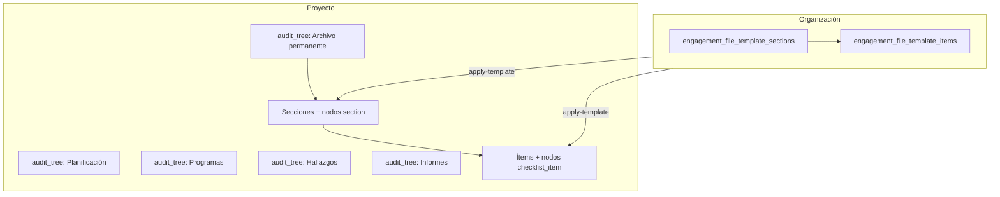

# Jerarquía del encargo y plantillas (todo en un vistazo)

Este archivo es **el único mapa** de cómo encajan árbol, plantilla de firma y proyecto.

---

## Diagrama único (jerarquía real)

```
┌─ ORGANIZACIÓN (firma) ─────────────────────────────────────────────────────┐
│                                                                             │
│   Plantilla maestra del “Archivo permanente” (molde por firma, varias):     │
│                                                                             │
│   engagement_file_templates   cabecera (nombre, is_default, project_tree_snapshot opcional) │
│            │                                                                │
│            ├── engagement_file_template_sections   carpetas (ej. KN01…)   │
│            │        └── engagement_file_template_items   tareas             │
│            │                                                                │
│   Plantilla del sistema (única, producto): **no** tiene fila en BD;         │
│   contenido en default-engagement-file-template-sections.js; API id `system`│
│                                                                             │
│   Cómo se llena:                                                            │
│   • POST …/templates/create (plantilla vacía) + sections/items              │
│   • POST …/load-defaults → copia JS a una plantilla (vacía) de la firma     │
│                                                                             │
└───────────────────────────────────────────────┬─────────────────────────────┘
                                                │
                        apply-template          │  copia molde → proyecto
                        (por proyecto)        ▼
┌─ PROYECTO (un encargo) ────────────────────────────────────────────────────┐
│                                                                             │
│   audit_tree_nodes                    ← al CREAR proyecto (automático)      │
│   │                                                                         │
│   ├── type: engagement_file     "Archivo Permanente"                        │
│   │       │                                                                 │
│   │       └── (después de apply-template: hijos bajo esta raíz)            │
│   │               ├── nodo section  ←→  engagement_file_sections           │
│   │               │       └── nodo checklist_item  ←→  checklist_items       │
│   │               │               └── evidencia: archivos + evidenceText    │
│   │               └── … más carpetas e ítems …                               │
│   │                                                                         │
│   ├── type: planning            "Planificación"     (solo raíz hoy)       │
│   ├── type: programs            "Programas…"         (solo raíz hoy)       │
│   ├── type: findings          "Hallazgos"            (solo raíz hoy)       │
│   └── type: reports           "Informes"             (solo raíz hoy)       │
│                                                                             │
│   Tablas de instancia del permanente (lo que se edita en el encargo):       │
│   engagement_file_sections  +  checklist_items                              │
│   (cada una enlazada a su nodo en audit_tree_nodes)                         │
│                                                                             │
└─────────────────────────────────────────────────────────────────────────────┘
```

**Orden de operaciones en la vida real**

1. Listar opciones: `POST …/organizations/engagement-file-template/templates/list` → incluye `{ id: "system", isSystem: true }` y las de la firma.
2. `POST /projects/create`: las raíces en `audit_tree_nodes` salen del **ajuste global** `project_tree_template` salvo que la plantilla usada tenga `project_tree_snapshot` (JSON, mismo formato que el ajuste global) y se elija al crear: id numérico en `applyEngagementFileTemplate` o explícito en `projectTreeFromEngagementTemplateId`. `applyEngagementFileTemplate` opcional: `"system"` o id (requiere permiso `projects.engagementFile.manage` al aplicar).
3. O bien después: `POST /projects/.../engagement-file/apply-template` con `data.engagementFileTemplateId` omitido (plantilla **por defecto** de la firma), `"system"`, o id de plantilla.

---

## Mismo mapa en Mermaid (si tu visor lo renderiza)



Las raíces R2–R5 existen al crear el proyecto; **no** tienen plantilla en BD todavía.

---

## Tabla rápida “qué tabla es qué”

| Dónde | Tabla(s) | Cuándo se usa |
|-------|-----------|----------------|
| Firma | `engagement_file_templates` | Varias plantillas por org; una puede ser `is_default`; `project_tree_snapshot` opcional sustituye raíces del árbol al crear proyecto con esa plantilla |
| Firma | `engagement_file_template_sections`, `engagement_file_template_items` | Molde por plantilla; `apply-template` lee la elegida (o la por defecto) |
| Producto | (ninguna tabla) | Plantilla sistema: mismo contenido que la semilla JS; id API `"system"` |
| Proyecto | `audit_tree_nodes` | Árbol UI; raíces al crear proyecto; resto al aplicar plantilla |
| Proyecto | `engagement_file_sections`, `checklist_items` | Carpetas y tareas **de este encargo**; evidencia en ítems |

---

## Archivos de código (semilla y motor)

| Archivo | Rol |
|---------|-----|
| `helpers/tree-seed.js` | Raíces al crear proyecto: global org o, si aplica, `project_tree_snapshot` de la plantilla de expediente |
| `helpers/default-engagement-file-template-sections.js` | Semilla **solo** para `load-defaults` → tablas plantilla |
| `helpers/engagement-file-template.js` | Función `applyTemplateToProject` |

P/C (`retentionScope`) y **dónde ubicar esto en la UI de configuración**: `docs/frontend/api/engagement-template-retention-scope.md` (apartado “Dónde mostrarlo en la app”).  
**Listados de plantilla** (`sections/list`, `items/list` sin drill-down): un solo array **`hierarchy`** (`nodeKind`: `project_root` → `children` → `template_section` → `items` / `template_item` en `items/list`). Sin duplicar listas planas al mismo nivel.
