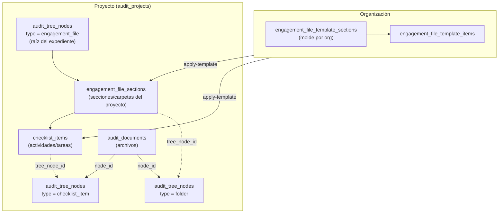
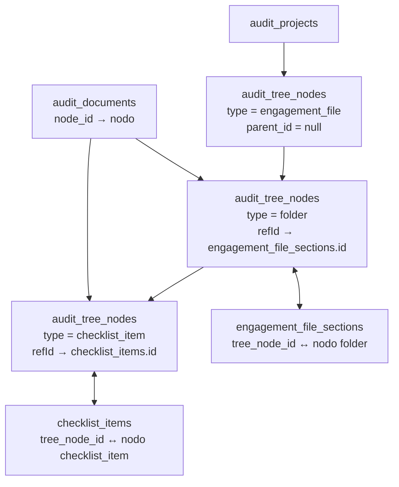

# Mapa: árbol + expediente estructurado (cómo queda)

Estado **objetivo** del esquema: un solo núcleo por proyecto (plantilla → secciones → ítems → árbol → documentos).  
Convención de nombres en este doc: **`engagement_file`** (tablas, rutas, permiso). Si al implementar elegís otro prefijo, sustituí en bloque.

---

## 1. Vista de capas (qué es qué)



- **Plantilla:** solo `organization_id`; define la estructura estándar.
- **Instancia:** `engagement_file_sections` tiene `audit_project_id`; cada sección tiene muchos `checklist_items` vía `section_id`.
- **Árbol:** cada sección e ítem con `tree_node_id` sincronizado; la UI navega con `tree/full` y `node-detail`.
- **Documentos:** siempre `audit_documents.node_id` → id del nodo (carpeta o ítem); N archivos por nodo.

---

## 2. Árbol (`audit_tree_nodes`) — nodos y enlaces



| Nodo `type`        | `refId` apunta a              | Documentos              |
|--------------------|-------------------------------|---------------------------|
| `engagement_file`  | — (raíz)                      | opcional                  |
| `folder`           | `engagement_file_sections.id` | N por `node_id`           |
| `checklist_item`   | `checklist_items.id`          | N por `node_id` (evidencia) |

---

## 3. Tablas (estado final)

| Tabla | Rol |
|-------|-----|
| `engagement_file_template_sections` | Secciones plantilla por organización |
| `engagement_file_template_items` | Ítems plantilla por sección de plantilla |
| `engagement_file_sections` | Secciones del proyecto; `audit_project_id`, `parent_section_id`, `tree_node_id` |
| `checklist_items` | Ítems del proyecto; `section_id` → `engagement_file_sections`, `tree_node_id` |
| `checklist_item_assignees` | Asignados por ítem |
| `audit_tree_nodes` | Jerarquía única por proyecto |
| `audit_documents` | Archivos; `audit_project_id`, `node_id` |

---

## 4. API (rutas finales)

| Ámbito | Base path |
|--------|-----------|
| Proyecto — secciones/ítems/apply-template | `POST /api/v1/projects/engagement-file/...` |
| Organización — plantilla | `POST /api/v1/organizations/engagement-file-template/...` |
| Árbol (sin cambio de path) | `POST /api/v1/projects/tree/full`, `node-detail`, `create`, etc. |

Ejemplos:

- `.../engagement-file/sections/create|list|view|update|delete`
- `.../engagement-file/items/create|list|update|delete`
- `.../engagement-file/items/documents/list`
- `.../engagement-file/apply-template`
- `.../engagement-file-template/sections/...` y `.../items/...`
- `.../engagement-file-template/load-defaults`

---

## 5. Permiso

- **`projects.engagementFile.manage`** — crear/editar/borrar secciones e ítems del expediente (y apply-template donde aplique).

---

## 6. Código — ubicación final

```text
app/projects/engagement-file/
  sections/   items/   apply-template/

app/organizations/engagement-file-template/
  sections/   items/   load-defaults/

app/projects/tree/          # full, node-detail, create, move, delete, …

models/audit/engagementFileSection.js
models/organizations/engagementFileTemplateSection.js
models/organizations/engagementFileTemplateItem.js
models/audit/checklistItem.js

helpers/engagement-file-tree-sync.js
helpers/engagement-file-template.js
```

---

## 7. Resumen en una imagen

```text
                 ORGANIZACIÓN
                      │
      ┌───────────────┴───────────────┐
      │  engagement_file_template_*    │
      │       sections → items         │
      └───────────────┬───────────────┘
                      │ apply-template
                      ▼
                 PROYECTO
                      │
      ┌───────────────┴───────────────┐
      │  engagement_file_sections      │
      │       └── checklist_items      │
      └───────────────┬───────────────┘
                      │ sync
                      ▼
           audit_tree_nodes
           (raíz engagement_file)
                      │
        ┌─────────────┴─────────────┐
        │ folder    checklist_item   │
        └─────────────┬─────────────┘
                      │
           audit_documents.node_id
```

---

## 8. Referencias

- Pasos para llegar a este esquema: [`roadmap-centralizar-expediente.md`](roadmap-centralizar-expediente.md)
- Índice: [`../README.md`](../README.md)
