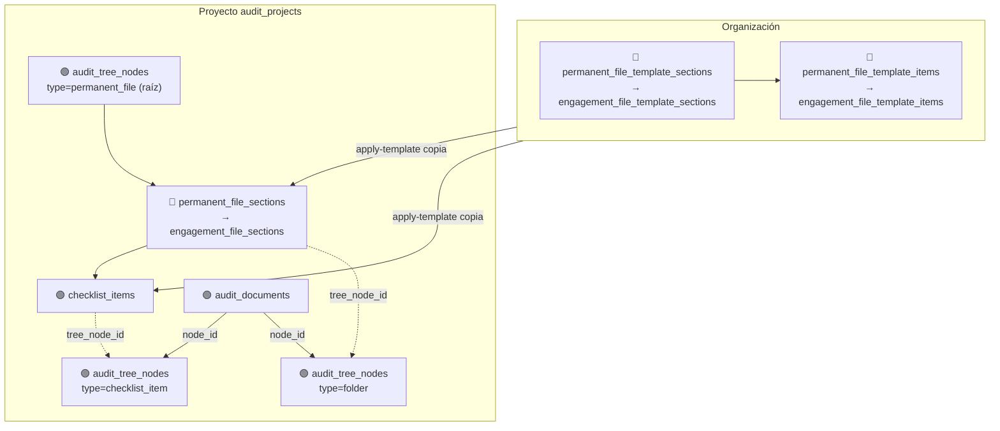
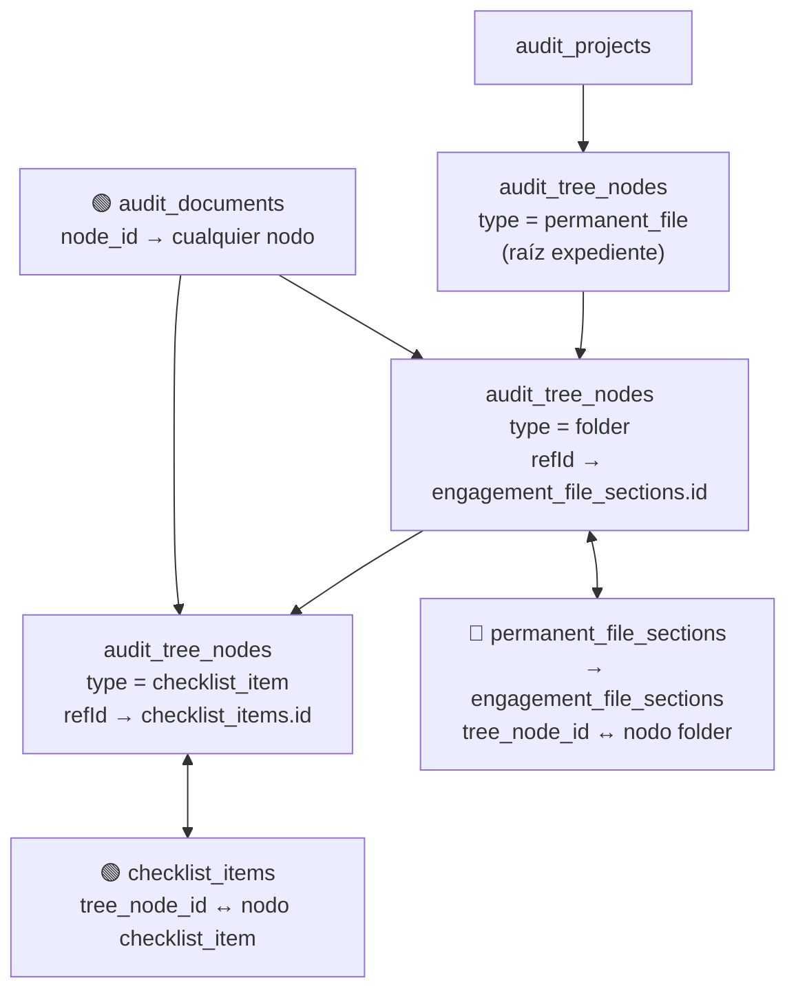
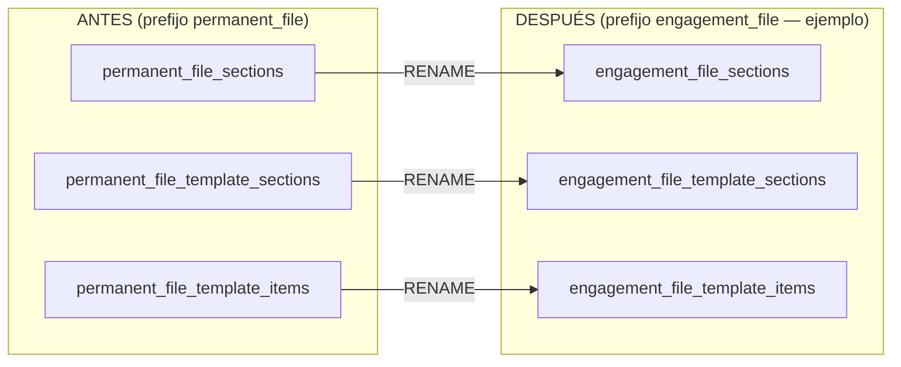
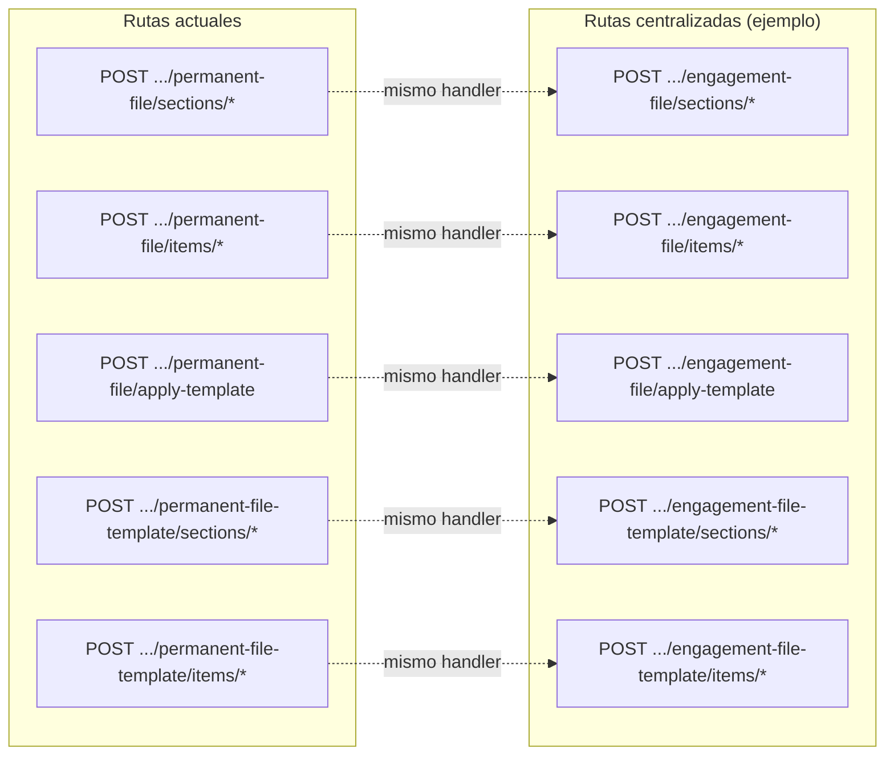
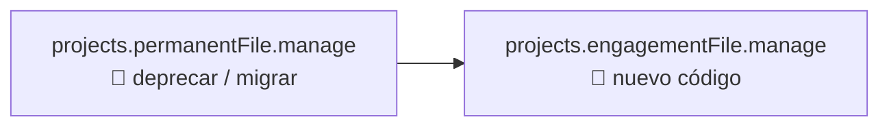

# Mapa: árbol + expediente estructurado (antes / después del centralizar)

Referencia visual de **qué se renombra** y **qué no se toca**, y cómo encaja todo con `audit_tree_nodes` y `audit_documents`.

**Convención en los diagramas**

- 🔴 **Cambia nombre** (tabla, ruta API o permiso)
- 🟢 **Sin cambio de nombre** (sigue igual; solo actualizar FKs/imports si aplica)
- 🔵 **Flujo / contenedor**

---

## 1. Vista de capas (qué es qué)



---

## 2. Árbol (`audit_tree_nodes`) — qué nodos existen y qué apuntan



**Nota:** El **type** del nodo raíz puede seguir llamándose `permanent_file` en BD (semántica “archivo permanente como área”) o unificarse a `engagement_file` en una migración de datos; el mapa lógico no cambia.

---

## 3. Tablas: antes → después (solo renombrado)



**Sin renombrar (siguen iguales):**

| Tabla | Rol |
|-------|-----|
| `audit_tree_nodes` | Jerarquía única por proyecto |
| `checklist_items` | Ítems/tareas; `section_id` → tabla renombrada |
| `checklist_item_assignees` | Asignados por ítem |
| `audit_documents` | Archivos; `node_id` → nodo |

---

## 4. API: rutas antes → después



Opcional: registrar **ambas** rutas un tiempo (alias deprecado).

---

## 5. Permisos



Misma asignación a roles; cambia el `code` en `permissions` (+ `role_permissions`).

---

## 6. Código: carpetas y archivos que se mueven/renombran

```text
app/projects/permanent-file/          →  app/projects/engagement-file/
app/organizations/permanent-file-template/  →  app/organizations/engagement-file-template/

models/audit/permanentFileSection.js           →  models/audit/engagementFileSection.js
models/organizations/permanentFileTemplateSection.js  →  .../engagementFileTemplateSection.js
models/organizations/permanentFileTemplateItem.js     →  .../engagementFileTemplateItem.js

helpers/permanent-file-tree-sync.js   →  helpers/engagement-file-tree-sync.js
helpers/permanent-file-template.js    →  helpers/engagement-file-template.js
```

**Árbol (sin mover de carpeta, solo imports):**

- `app/projects/tree/full`
- `app/projects/tree/node-detail`
- `app/projects/tree/create|move|delete|...`

Siguen igual; por dentro pasan a usar los modelos/helpers con nombre nuevo.

---

## 7. Resumen en una imagen mental

```text
                    ORGANIZACIÓN
                         │
         ┌───────────────┴───────────────┐
         │  PLANTILLA (molde)            │
         │  template_sections            │
         │       └── template_items      │
         └───────────────┬───────────────┘
                         │ apply-template
                         ▼
                    PROYECTO
                         │
         ┌───────────────┴───────────────┐
         │  INSTANCIA                     │
         │  engagement_file_sections      │
         │       └── checklist_items      │
         └───────────────┬───────────────┘
                         │ sync
                         ▼
              audit_tree_nodes (único árbol)
                         │
              ┌──────────┴──────────┐
              │ folder   checklist_item │
              └──────────┬──────────┘
                         │
              audit_documents.node_id
              (N docs por nodo)
```

---

## 8. Dónde sigue el detalle paso a paso

- Hoja de ruta con fases y checklists: [`roadmap-centralizar-expediente.md`](roadmap-centralizar-expediente.md)
- Índice general: [`../README.md`](../README.md)

Cuando elijas el prefijo final (`engagement_file` u otro), sustituí en este doc los nombres de ejemplo.
